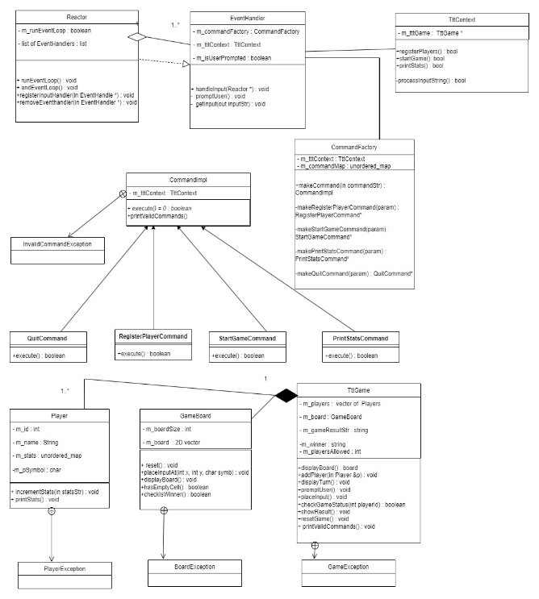
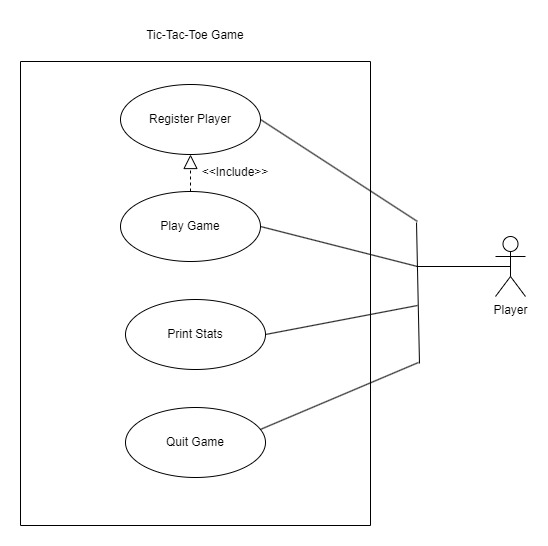
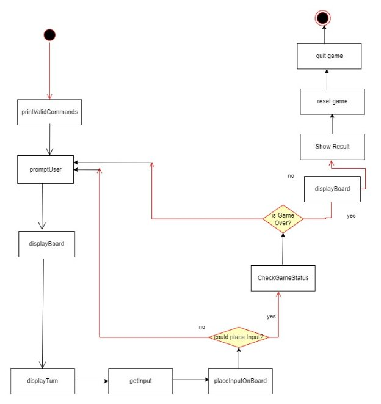

TIC-TAC-TOE

# Requirement Analysis:

Tic-tac-toe, in general is a very simple game but can be extended to have many variations. Here we are listing out the features of a relatively complex variant of tic-tac-toe. 

Later, we will filter out a subset of these features and implement them.  After discussion over the implementation details, we will also discuss how this implementation can be extended to include additional features.

In the requirement analysis below, game tournaments are intentionally skipped to reduce complexity.

**Features Of Tic-Tac-Toe:**

- Start tic-tac-toe application
- Select Game mode
  - Offline
  - Online
- Select Game variation
  - Classic: When one player wins, exit the game
  - Reverse-classic: Game ends when only one player is left in the game.
- Select Game Configuration
  - Enter number of players: 
  - Board size: (no. of players + 1) ^2
- Register Players (depends on the values entered above)
  - Offline mode
  - Player1 > 
    - Name
    - Symbol

`                        `………..

- Playern > 
  - Name
  - Symbol
- Online mode
  - Play with friends
    - Select friends and register them as players
  - Players are automatically matched online.
- Start Game

Game >

` `While the game is not over:

`	`Display the game board

`              `Display/highlight the player’s turn

`              `Take input from users

`              `PlaceInput on the board

`	`checkGameStatus

`	`If game over:

`	       `Display result & update player stats

`                      `exit

` 		               `Else:

`			       `Keep playing

- Additional Game options	
  - Timed game?
  - Undo/redo allowed in game.
  - Spectators?

# Implemented Requirements:

Although we have listed out an exhaustive list of features, for this demo implementation we have selected a subset of features from above list to implement. We will try to do this implementation in such a way that other extension and additional features can easily be added.

**Implemented Features:**

- Open tic-tac-toe app
- For this Implementation, only one game mode, one game variation and configuration are considered.
  - Game mode: Offline
  - Game variation: classic
  - Game configuration:
    - 2 players 
    - 3X3 Game board
  - So, game settings are not taken as input from user.
- We will implement this tic-tac-toe game in “command prompt/CLI” mode.
- This command prompt will support 4 commands
  - register\_players
  - start\_game
  - print\_stats
  - quit

Details about the game interface, method to ‘build and run’ and object-oriented design details are given below.

# Tic-Tac-Toe Interface(Implemented):
`	`
# 
#
# How To Build and Run:
`	`The code has been written using c++ and compiled using gcc version (8.3.0)

**Installation Prerequisites:**

- cmake version >= 3.21

**Build:**

- Checkout the code from GitHub:   “https://github.com/Low-Level-Design/LLD/tree/main/tic-tac-toe” 
- Go to tic-tac-toe directory
- Go to ‘build directory’
- Cmake ..  <enter> [to prepare for the build]
- Make [to build the code]
- At the end of the ‘make’ command, a fresh executable should be created at ‘gameexe/tic-tac-toe’ under the build directory

**Clean Build:**

- Clean build is like normal build. You need to delete all files under ‘build’ directory before firing the ‘cmake’ command.

**Start/Run Tic-tac-toe:**

- Command: ./build/gameexe/tic-tac-toe
# Object Oriented Design:

The entire Tic-tac-toe design can be divided into 2 parts based on its requirement and implementation:

**Command-line Interface & User Input Implementation:**

- Command line interface loop has been implemented using Reactor & EvenHandler classes. This code follows ‘Reactor’ pattern.
- Different types of possible user commands have been implemented using command class hierarchy. Different command classes used in this implementation are CommandImpl, QuitCommand, RegisterPlayerCommand, StartGameCommand and PrintStatsCommand. An additional class named CommandFactory has been used to construct the correct type of command class using ‘factory method design pattern’. Also, command class hierarchy follows ‘command design pattern’. Each class implements its own ‘execute’ method.

**Core Tic-tac-toe Object Model:** The core tic-tac-toe includes the following classes:

- TttContext class:

To implement any type of command action, we have implemented a wrapper class called ‘TttContext’. This class holds a reference to the TttGame class. This class acts as a game controller or a wrapper class. Primary responsibility of this class is to implement each action of user command. It also acts as a bridge for TttGame class.

- Tic-tac-toe core classes:

- TttGame: holds all the components of a tic-tac-toe game. This class includes a list of players and gameboard. It basically represents a tic tac toe game.

- Player: represents a player of tic tac toe game. It primarily includes player name, id, stats etc.

- GameBoard: This class represents a game board of specific size. It includes boardsize, 2D board etc.

`                  `**Additional Classes:**

- Exception classes:  The design also includes some exception classes like InvalidCommandException, GameException, PlayerException & BoardException. All the exception classes have been implemented as inner classes.

`  `**Design Patterns Used:**
**

**
`  `The tic-tac-toe implementation effectively uses different design patterns. The design patterns 

`  `used are listed below:

- Reactor pattern: To implement the CLI loop. 
- Command pattern: To implement the command hierarchy.
- Bridge Pattern: To implement the game controller/wrapper.
- Factory Method Pattern: To construct CommandImpl objects.
**

**Class Design & Class Diagram:**

**Use-Case Diagram:**

**Play Game Activity Diagram:**

`     `****

# Implementing Additional Features:

In this section, let us discuss on how we can extend our existing code to incorporate the extra features that we skipped during our implementation. Below, I am listing again the additional features we discussed before during requirement analysis as a recap:

**Features Of Tic-Tac-Toe:**

- Select Game mode
  - Offline
  - Online
- Select Game variation
  - Classic: When one player wins, exit the game
  - Reverse-classic: Game ends when only one player is left in the game
  - ‘Vs robot’: One player vs bot. When one player wins game ends.
- Select Game Configuration
  - Enter number of players: 
  - Board size: (no of players + 1) ^2
- Register Players
  - Offline mode
  - Player1 > 
    - Name
    - Symbol

`                        `………..

- Player n > 
  - Name
  - Symbol
- Online mode
  - Play with friends
    - Select friends and register them as players
  - Players are automatically matched online.
- Start Game

Game >

` `While the game is not over:

`	`Display the game board

`              `Display/highlight the player’s turn

`              `Take input

`               `PlaceInput

`	`checkGameStatus

`	`If game over:

`	       `Display result & player stats

`                      `exit

` 		               `Else:

`			       `Keep playing

- Additional Game options	
  - Timed game?
  - Undo/redo allowed in game.
  - Spectators?
  - Global Player ranking

`     `**Implementation Of Extended Features:**

- Taking game settings as input: This enhancement is to enable the users to enter the settings like ‘Game Mode’, ‘Game Variation’ & ‘Game Configuration’, we can introduce a new command line option called “enter\_settings” in the same way as adding any new command. Also, we add a new function in TttContext class named ‘enterSettings’. 

Now, in this function the user will be allowed to enter all the values and these values will be stored in a global singleton class called ‘GameSettings’ GameSettings::getInstance (with all values). Later, from any part of the program this GameSettings global instance can be accessed (GameSettings::getInstance ()) and used.

Different types of game setting entered are:

- Select Game mode
  - Offline
  - Online
- Select Game variation
  - Classic: When one player wins, exit the game
  - Reverse-classic: Game ends when only one player left
  - Vs robot: Player vs bot. When on player wins game ends.
- Select Game Configuration
  - Enter number of players: 
  - Board size: (no of players + 1) ^2

- Enhancement of register\_players functionality based on settings: 
  - Register players in offline mode: If offline mode was selected, after register\_players command, it will display the prompt to register players based on the settings.
    - Register\_players for ‘Vs robot’: For this case, players details of 1 player is taken from the user and details of another player (i.e., robot) is registered automatically. 
      - Implementation changes: In function registerPlayers in class TttContext, changes should be added for this. If gameSetting::getInstance () has the ‘Vs robot’ game variation populated, then it will only take one player details and add it to the list of players in TttGame. Additionally, it will create another special Player object with the details of robot and add it to the list of players
- Register Players
  - Offline mode [ If ‘Vs robot’]
  - Player1 > 
    - Name
    - Symbol
    - Register\_players for non ‘Vs robot’: For this case, details of all the players player are taken from the user. Number of players depends on the game configuration entered.
      - Implementation changes: In function registerPlayers in class TttContext, changes should be added for this. If gameSetting::getInstance () shows non ‘Vs robot’, then it will take all the players (number depends on the settings). configuration from the user and add it to the list of players in TttGame.
- Register Players
  - Offline mode [ If non ‘Vs robot’]
  - Player1 > 
    - Name
    - Symbol

`                              `………..

- Player n > 
  - Name
  - Symbol

- Register players in online mode: skipped for simplicity        
- TttGame object initialization: The moment, first player is registered we initialize the game. After that we keep on adding the players to the game. In this game variation number of players can be anything. Once the players are registered, Gameboard will be initialized based on the formula [gameboard size = (no of players + 1) ^2] as mentioned in the GameSetting::instance.

- Enhancement of start\_game functionality based on settings:  As we are now supporting a more generic variation of the game, each step of ‘start\_game’ will become more generic. TttContext class implements the following functions to implement the ‘start\_game’ functionality. Changes in this function are discussed below:

Game >

While the game is not over:

- Display the game board. Here the display board function should be able to handle any board size.
- Display/highlight the player’s turn: When we have any number players, the turn can be implemented in a round-robin fashion. 
  - Implementation change: Have a queue of players should be there in TttGame instead of an array. 
- Take input: Same as before for non ‘vs bot’ games. In the case of ‘Vs bot’, If it is bot’s turn no input prompt is needed. Rather a special function like “generateInputForBot” can be called to handle the auto input here. “generateInputForBot” can be restricted to be called only by a bot player. All the logic and computation to generate the input can be implemented here.
- PlaceInput: same as before
- checkGameStatus: Because we have different game variation, strategy pattern can be used here.
  - Implementation details: Create a hierarchy to represent different game strategies. Each strategy class can have a function called checkGameStatus.
  - Class TttGame will have a reference object (m\_gameStrat) of this class. This reference will be initialized with the correct game strategy class at the time of initialization of TttGame. The initialization will depend on the GameSettings::\_instance values.  
  - TttGame::checkGameStatus will call m\_gameStrat.checkGameStatus() to check using the correct strategy.
- If game over:
  - Display result & player stats: same as before
  - Exit
- Else:
  - Continue playing

**Implementation Of Redo/Undo Functionalities:**

A modified version of memento design pattern can be used to implement undo/redo option for

` `tic-tac-toe. 

A state in a tic-tac-toe game can be represented using a board and its placed symbols. Which is 

nothing but a series of inputs applied on the board. So, a particular state of tic-tac-toe can also 

` `be represented using a series of moves. If the user wants to undo in the game at any point of 

time, this action can be implemented by undoing the last move of the user [ for a user to be

able to do ‘undo’, the user must have done the last move]. When the user wants to do a redo,

this action can be implemented by replacing the “previously undone move” input.

- Classes required:
  - Class TttGame (modified):
    - MoveStorer & m\_mStorer
    - Save (Move m):
      - Create a MoveMemto & store in m\_mStorer (MoveStorer)
    - Undo ():
      - Call m = m\_mStorer. getLastMemto ()
      - If m is null, undo not possible
      - Unset the board for x, y position in m.getMove() object.
    - Redo ():
      - Call m = m\_mStorer. getNextMemto ()
      - If m is null, redo not possible
      - Put the symbol at the x, y position obtained from m. getMove() object.
  - Class Move:
    - Int x, int y, char symbol

- Class MoveMemento: represents a game move
  - ` `Move m
  - getMove ()
- Class MoveStorer:
  - stack<Memento> moves;
  - stack<Memento> redoStack

- addMove : push to moves stack

- getLastMemto ():

- m = moves.pop ()
- push m to redoStack
- return m
- getNextMemto ():
  - m = redoStack.pop ()
  - push m to moves stack
  - return m

- Game commands added:
  - Redo & undo within a game

- Undo/Redo flow:
  - While the game is not over
    - The user can give undo/redo commands while in the game
    - To implement undo call tttGame.undo().
    - To implement undo call tttGame.redo().
    - Continue with the game while the game is not over.

**Global Ranking Of Players:** TODO

**Timed Tic-tac-toe:** TODO

**Spectated Game:** TODO

**Other Implementation Optimizations:**

Here we discuss the alternative ways of implementing some of the existing code to achieve a better runtime:

- O(n) implementation of checkGameStatus: In our implementation of checkGameStatus of tic-tac-toe, we have used O(n^2) algorithm. Here we discuss about the algorithm to achieve checkGameStatus in O(n) time.
  - To implement it in O(n), the most important observation is that the person making the move currently can only win. So, it is enough to check only the corresponding row, col, and diagonal(s) where the move was made. 
  - This algorithm works for any number of players.

Current move

- O (1) implementation of checkGameStatus:  Implementation of checkGameStatus can be further optimized to work in O (1).
  - This optimization will only work for 2 player game of any board size
  - Algorithm:
    - Define 2 arrays and 2 variables to keep the count of X’s (+1) and O’s (-1). Arrays must be of size ‘boardsize’
      - Rows[boardsize], cols[boardsize], lrDiag, rlDiag.
    - Whenever symbol ‘X’ is placed add 1, else add -1
    - While placing the symbol ‘X’ at x, y, it will update (+1) for rows[x], cols[y] and increment lrDiag or rlDiag if the co-ordinate (x, y) lies on the diagonals.
    - Check for winning condition:
      - After placing symbol at (x, y) if |rows[x]| == boardsize or |cols[y]| == boardsize or |lrDiag| == boardsize or |rlDiag| == boardsize, then this symbol(player) is the winner.

- Deciding PlayersTurn when number of players are more than 2: In our current implementation, class TttGame stores a list of players. But, storing it as a queue of players will make it easy to decide the player’s turn in a round-robin fashion.
# Conclusion:

` `Here, we conclude the discussion on LLD of tic-tac-toe. We sincerely hope you enjoyed the read and it 

` `was helpful for you.

` `If you have ideas/suggestions to improve the design or any generic feedback please feel free to 

connect with us over email <shabnam.banu@gmail.com>.

#
